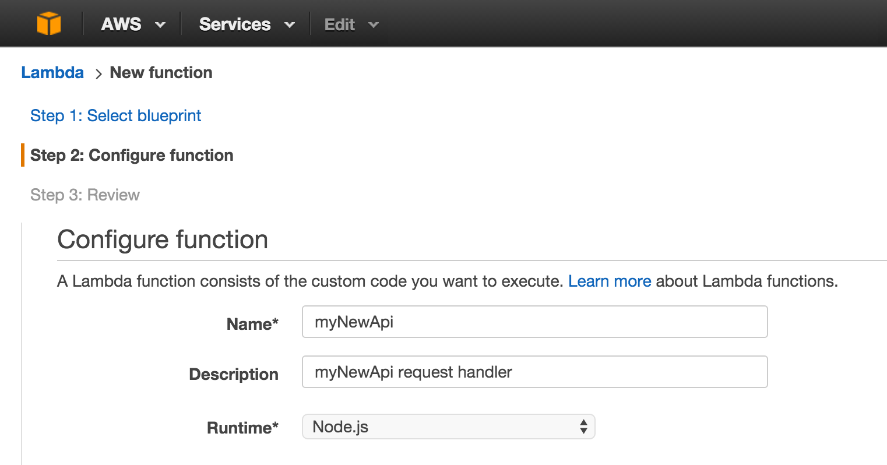
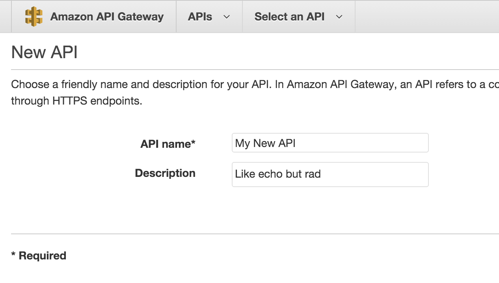
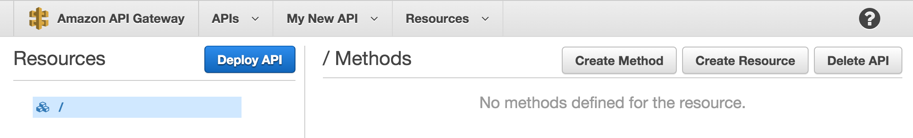

# Zero to API in Ten Minutes, with Amazon API Gateway and AWS Lambda

Servers are annoying, even in the age of cloud services.
You choose them, provision them, configure them, deploy to them,
monitor them, meter them.  You decide when to add or remove them.
And at the end of the month, you need to pay for what you used,
and what you didn't.

There is quite a lot to be said for a serverless architecture.
It's the quickest and cheapest way off the ground, for the hobbyist and
scrappy startup alike.  The explosion of SaaS in recent years has
paved the way for the concept of "servers" to be someone else's problem.

But there are things only servers can do properly.  Cryptographic
secrets, for instance, can't be fully protected in browsers or mobile
apps.  Servers provide stronger assurances that a process will be run to
completion.  And browsers, though fast and reliable, are slow as hell
and maddeningly uncontrollable.

## Enter Amazon

It was in this climate that
[Amazon Web Services](https://aws.amazon.com),
industry leaders in managing large pools of computing resources,
introduced the
[Lambda](https://aws.amazon.com/lambda) platform for ephemeral
computing.  Users could supply code, and based on certain
triggers it would run *somewhere*, not immediately but
milliseconds-soon.  There were plenty of limitations at first --
a 60 second execution limit, to name but one --
but the service offered pure, serverless, on-demand computing, and
at [prices that small-to-medium businesses had no hope of
matching themselve themselves](https://aws.amazon.com/lambda/pricing/).

Not much later, the Lambda system was integrated into
[Amazon API Gateway](https://aws.amazon.com/api-gateway/),
closing the loop on serverless API architecture and
[offering similar fire-sale
prices](https://aws.amazon.com/api-gateway/pricing/) to Lambda.

At this point, API Gateway and Lambda are mature and production-tested
products, and as long as your API requirements don't include white-hot
response times or long-lived requests, they're a very attractive option
for the startup on a tech-spend diet.

The great news is that it's not only cheap to stand up an API with API
Gateway, it's also quick work.  Ten minutes if you're copy-pasting,
half an hour if you're a good typist.

The work can be broadly divided into three steps:

* Write a request handler
* Install it as a Lambda
* Create an API in API Gateway, and connect the Lambda to a resource and
  method

Let's dive in.

## Write the Request Handler

In this article, we'll stick to the AWS Lambda default of JavaScript,
so we'll need a working Node.js installation.  On a Mac with
[Homebrew](http://brew.sh/), run `brew update; brew install node`.

We'll start by writing a request handler in plain JavaScript.
Let's make a skeleton project to hold our request handler:

    mkdir myNewApi
    cd myNewApi
    mkdir lib test
    touch lib/my_new_api.js test/my_new_api_test.js index.js package.json

In `package.json`, we have the usual content, as well as a script to generate
a `.zip` from the contents of `myNewApi`.

    {
      "name": "myNewApi",
      "version": "0.0.1",
      "description": "Wicked awesome test API",
      "author": "pete gamache <pete@appcues.com>",
      "main": "index.js",

      "dependencies": {
      },

      "devDependencies": {
        "chai": "*",
        "mocha": "*"
      },

      "scripts": {
        "zip": "zip -r ../myNewApi.zip *"
      }
    }

Our `index.js` holds what we might deem "controller" code.  It contains the
handler which AWS invokes as the main function of the Lambda.  We load a
config file and our main code, and in `exports.handler` we invoke a
function we're about to write, `handleRequest`, passing it `event` (a JS
object containing the JSON-decoded request body), `config` (a JS object
loaded from our config file), and a Node-style callback of the form
`function (err, responseObject)`.

    var package = require("./package.json");
    var myNewApi = require("./lib/my_new_api.js");

    console.log("loaded " + package.name + ", version " + package.version);

    exports.handler = function (event, context) {
      myNewApi.handleRequest(event, context.done);
    }

In `lib/my_new_api.js`, we place a request handler which invokes its
given callback with a wrapped version of its input data:

    exports.handleRequest = function (requestData, callback) {
      var responseData = {received_as_input: requestData};
      callback(null, responseData);
    }

We are civilized humans in the twenty-first century.
We shall write a test.
In `test/my_new_api_test.js`:

    var assert = require("chai").assert;
    var myNewApi = require("../lib/my_new_api.js");

    describe("myNewApi", function () {
      it("exports handleRequest", function () {
        assert.typeOf(myNewApi.handleRequest, "function");
      });
    });

With the files in place, run `npm install` to ensure all dependencies
are installed.

At this point, you should be able to type `mocha` at the command prompt
and see 1 passing test.

## Set up the Lambda

Now it's time to take the code we just wrote and install it as a Lambda.
This can be done with the AWS API, but here we will do it using the AWS
Console on the web.  Log into AWS, click on AWS Lambda, and click past
any "Get Started" or "Select blueprint" crap.  We're aiming for "Configure
function".

### Configuring the Lambda

#### Configure function

Enter a camelCased name for your function, along with a description of
what it does.  Keep Node.js selected as our runtime.  Here's an example.

#### Lambda function code

For "Code entry type", choose "Upload a .ZIP file".  Recall that we
specified a script to zip up our code.  At a command line:

    npm run zip

And `myNewApi.zip` will appear alongside the `myNewApi/` directory.
Be sure you've run `npm install` beforehand!

#### Lambda function handler and role

The default Lambda function handler `index.handler` does not need
adjustment, because we set up our `index.js` to match.

For the "Role", we need to set up a Lambda execution role.  Select
"Create New Role > Basic Execution Role" from the dropdown menu, and
follow the instructions to create the role.

#### Advanced settings

These need no tweaking, but for more intensive tasks, the RAM and
execution time limit can be increased here.

Click on "Create Function" to save the Lambda to AWS.

### Testing the Lambda

Once we've saved the Lambda, a Test button appears, allowing us to send
a dummy payload to the function and observe its output.  With the
default test event, we should see results like the following:

## Create an API

OK.  The Lambda's in place, and we've watched it work.
It's time to set up API Gateway, so we
navigate to that section of our AWS console.

Create a new API.  Give it a name and a description.

You'll eventually land on the Resources page, where you can create
resources (paths) and methods on those resources.

Click on "Create Method".  Let's use POST as an example, so we can show
off more features than GET.  On the following screen, select "Lambda
function" as the integration type, and enter the details for the Lambda
we just created.  AWS will ask for permission to grant API Gateway
access to the Lambda; say yes.

We'll land on the `/ - POST` method page, where we can test our API for
the first time.  Click the Test button, enter `{"hello": "world"}` as
the request payload, and ensure that the response body is:

    {
      "received_as_input": {
        "hello": "world"
      }
    }

We are now one step away from having a real API.  Click the "Deploy API"
button in the sidebar.  Create a new stage.  Call it something.  Hit
"Deploy".

You'll see a url like
`https://f8fenu11tf.execute-api.us-west-2.amazonaws.com/prod` on the
next page.  Let's test it out on the command line:

    $ curl -X POST -d '{"hi":"mom"}' https://f8fenu11tf.execute-api.us-west-2.amazonaws.com/prod
    {"received_as_input":{"hi":"mom"}}

Congratulations! We have an API.

## Tips, Tricks, and Gotchas

* [Mapping templates](http://docs.aws.amazon.com/apigateway/latest/developerguide/api-gateway-mapping-template-reference.html),
  accessible in the Request Integration and Response Integration screens,
  may be used to transform request or response data, including adding
  request metadata from Amazon to request data from the user.  One
  particularly compelling use case is selecting different config
  parameters based on the value of the `stage` parameter.

  Be aware that input mapping templates match on content type, and thus
  depend on a properly-set `Content-Type` request
  header.  Also be aware that mapping templates can turn nulls into blank
  strings, depending on how they're put together, so make sure your
  request handling code is prepared for that.

* [Cross-origin resource sharing](http://docs.aws.amazon.com/apigateway/latest/developerguide/how-to-cors.html)
  can be enabled if you'd like to use your API from the browser without
  setting up a custom domain for it.  It involves creating an `OPTIONS`
  endpoint alongside your `POST` endpoint, and installing some access
  control headers.

* [Request and response models](http://docs.aws.amazon.com/apigateway/latest/developerguide/how-to-create-model.html)
  allow the validation of input and output against
  [JSON Schemas](http://json-schema.org).  This provides the opportunity
  for rudimentary input checking outside the Lambda, for example.

* API Gateway methods can be connected to not only a specific lambda,
  but [a specific version of a
  Lambda](http://docs.aws.amazon.com/lambda/latest/dg/versioning-aliases.html).
  This is a convenient way to pin
  an API Gateway stage to a precise version of a Lambda, for instance
  ensuring that the `prod` stage always points to the same code,
  regardless of further changes to the Lambda.  To use a specific version
  of a Lambda, paste that version's ARN into the API Gateway
  Create Method screen and deploy or redeploy the stages which should
  use it.

* [The JAWS Framework](https://github.com/jaws-framework/JAWS) provides a
  convenient way to structure and maintain
  serverless APIs written with Lambda and API Gateway.  It's still a young
  project, but it's gaining momentum quickly, and the improved source
  code management and scriptability make it an increasingly good choice
  for managing your serverless API.  And for Python, check out the
  emerging [PAWS Framework](https://github.com/braahyan/PAWS), heavily
  inspired by JAWS.

## Conclusion

We've only just scratched the surface of what API Gateway can do.
But we've still managed to set up an API in a matter of minutes,
including deployment, without provisioning a single server.
And it costs around five dollars per million requests.

If that sounds like a good fit for you and your project, give it a spin!

## About the Author

Pete Gamache is Head of Engineering at [Appcues](http://appcues.com),
an onboarding and user guides startup with a penchant for minimalist
architecture.  He is a proud API geek and enjoys living in the future.
[Follow him on Twitter](https://twitter.com/gamache).

